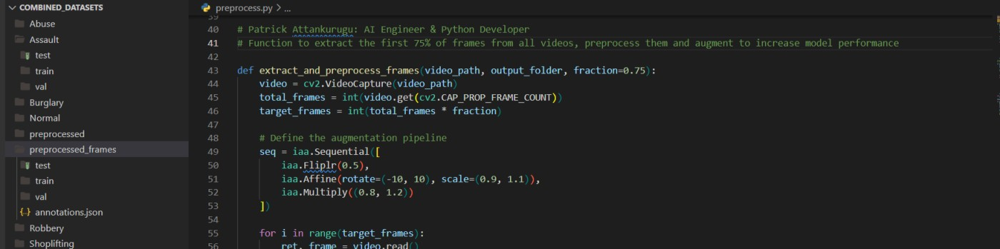

 

 
 

 

<h1>About me:</h1>

<h4>
 
I am a final year Computer Science student at the University of Ghana. 
  I am an aspiring software engineer and machine learning specialist.  
  My interest lie in building system that can think and make intelligent decisions  
  Currently, I am open to offers in software engineering as a national service personnel 
  Please chat me up on <a href="https://www.linkedin.com/in/patrickattankurugu1/" >LinkedIn</a>  
  
  .

</h4>

 
 

[website]: http://patrickattankurugu.github.io/
[linkedin]: https://www.linkedin.com/in/patrickattankurugu1/

### Languages & Frameworks.

          

### Github stats

<h3 align="left">Let's Connect 🤝</h3>

<a target="_blank"
href="https://www.linkedin.com/in/patrickattankurugu400/"></img></a> <a target="_blank"
href="mailto:patricka.azuma@gmail.com"></img></a> <a target="_blank"
href="https://twitter.com/PatrickAttanku1"></img></a>

